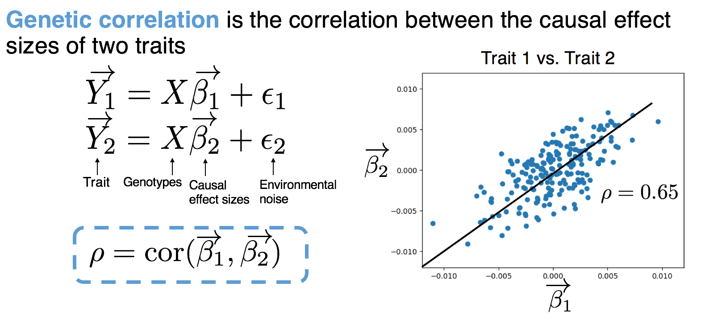
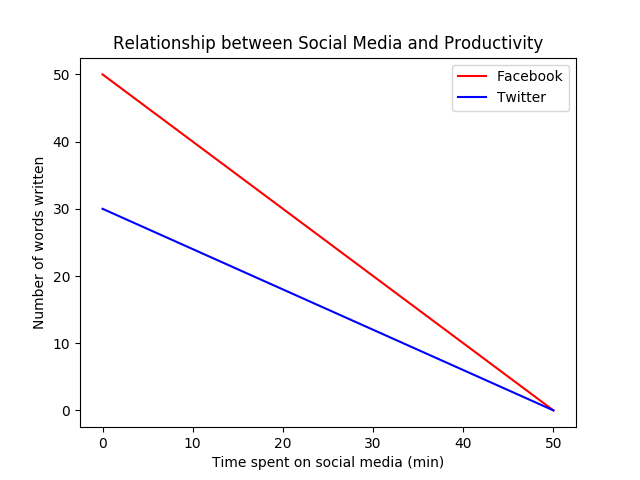
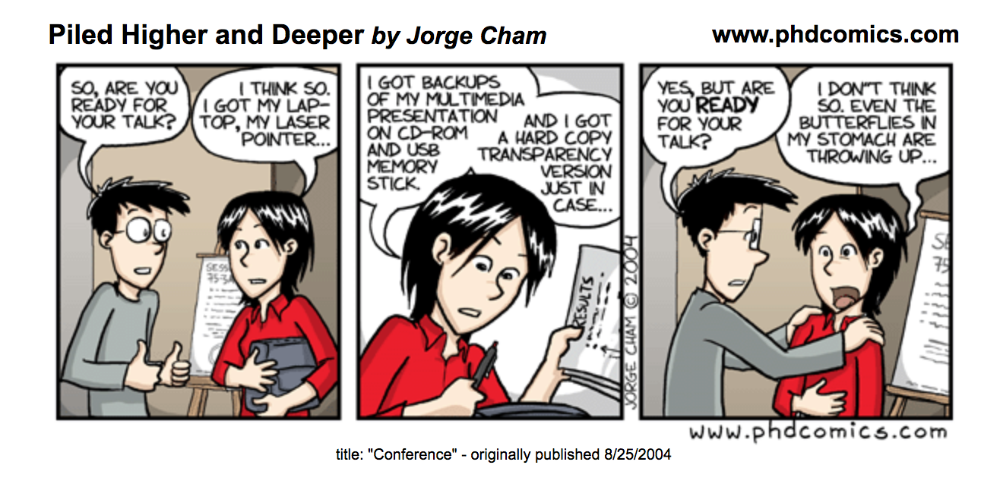

# 7 Tips for making presentations

An integral part of science is being able to communicate it to other people, and oftentimes this is done through presentations during conferences or other meetings. There are a few key pointers that I am constantly referring back to each time I make a presentation, and I mentally go through these as a brief checklist. This list stems from suggestions and comments from my advisor(s), lab-mates, conference attendees, friends, and others who were patient enough to hear me talk at them for 15-20 minutes. I thought it'd be useful to compile all of the main points, pass it along, and hopefully it'd also be useful for others. 

## 1. Explain the problem before you explain why it's hard, and then your solution. 

Myself and probably others are just too excited when it comes to talking about their science, so we'll jump right into the details about the work without thoroughly explaining the problem at hand. If an audience does not understand your problem, then they also won't fully appreciate how difficult it was nor your solution and/or findings. So although a presentation is oftentimes a medium to present your solution, it's important to set up your audience so that they can fully understand and appreciate what it is you've done. 
	
I think sometimes we fall into the trap of, "if a problem sounds really complicated, then people will think I'm smart". This may be true, but then your audience may feel dumb-- which no one really enjoys. A better approach would be thoroughly introducing your problem (making sure to spend adequate time on key points that will be referenced later), then walking through your solution and results *with* them. Then they think, "wow, I feel pretty smart now too, and it's because this really smart person taught me something today". It's a win-win for both parties. 

## 2. The main title of a slide should be the main message.

Each slide should try and communicate a main "take home" point per slide. And instead of trying and making the audience figure it out, just using this message as the slide heading makes it all the easier. And if one can't put the main message in a succinct statement, then maybe the slide should be broken up into two or more different slides. 
	
Additionally, you know the 'wet sponge absorbs more when wet' saying; this principle also follows. Opening a slide with the main message also will prepare people for what they're about to hear. And if you ever blank on a slide, hopefully having the main message front and center will help remind you about what you wanted to say. 
	
Note that a good tip before making the presentation is to do an outline where you list the main points of the presentation. Then from this list, each point gets a slide with the point as the slide title. 



*Here's an example from a presentation of mine. Although it can be tempting to label the slide "Intro to GWAS", this doesn't convey the main message that you want the audience to take away.*

## 3. If you didn't define the math, it doesn't go on your slide. 

I personally fall into this fallacy quite often. A lot of my research involves math and stats, most of it I spent many (sometimes frustrating) hours working to derive. Thus it is natural to want to showcase all of your hard work and 'cool' math in the presentation. However, no one will think your math is cool if they can't read and/or understand it. 
	
When presenting math, remember to clearly define every variable you use; not just verbally, but visually too. Again, if you didn't formally define it, it should not appear in your presentation. I personally make the equations show up line by line as I talk through each to avoid overwhelming the audience with a slide full of math. And if you're going to refer back to a variable you defined a few slides ago, provide a legend that will remind the audience what each symbol means. Finally, another suggestion is to color-label certain variables or equations if it helps to elucidate separate concepts; and then one can keep using the same color theme throughout the presentation. 



*Here's another example of a few small equations from a slide I had. I reference genetic correlation throughout the presentation, so I always use blue on the slide when doing so later on. Additionally, even though variable is labeled in words, I also will usually verbally note what each variable means.*

## 4. Don't say exactly what's on your slide.

A person will read the text on your slide faster than you can probably say it, thus if you recite exactly what's on the slide, there's a large chance that they won't be listening to you because they've already read it. A suggestion is to take the text that you'd want to verbally say, and then break it down into abridged statements; then use these statements as bullet points. 
	
If you're worried that you will need all of the text on the slide in the case you blank during the presentation, then you can put the full text in the speaker note section. I know that it's not recommended to directly read off any part of a presentation, but I also know that it can be nerve-wracking to present to an audience and a big fear is forgetting the words and freezing. I have personally found that having the full text in the speaker notes gives me the sense of a safety net for the 'just in case' and makes me less nervous-- even if I don't even refer to it during the presentation.  

## 5. Walk through each figure. 

This middle point sounds very simple and straightforward, but we can get so caught up that we forget about it. Oftentimes we think that because a figure has labels, then people will be able to read them and understand the figure on their own. But remember that a picture is worth 1,000 words and that's a lot to quickly take in during a presentation. It helps people digest and clearly understand the figure if you walk them through it, everything from the axes and down to the main message of the figure. And plus, this will also slow you down as you present. 

	
You can break down your description like this:

a) What is the figure describing?

b) Axes and/or unit of measure.

c) What the colors and/or lines correspond to.

d) What did we gain by representing our results in this figure. 

		

*(Note: I made this graph completely from my head; there is no scientific content being shown here, just as an example... though fairly similar to personal experiences.)*
	
**Here's a simple example!**
	
a) "Here we're plotting the relationship between the amount of time spent on social media and productivity levels."
	
b) "On the x-axis, we show the amount of time spent on social media in minutes, and on the y-axis we show the expected productivity level, measured in number of words written for a paper draft."
	
c) "We show the relationship between these two quantities by these lines, where the blue line shows this relationship for time spent on Twitter and the red line denotes this relationship for time spent on Facebook."
	
d) "Here we can see that overall productivity declines the more one engages in social media, but this decline is greater for time spent on Twitter than Facebook."
	

## 6. Hard questions

One of my personal fears (and I doubt I'm alone) is that I'd be asked a difficult question during the Q&As. When making a presentation, I like to go through and write down all of the possible questions I think may arise and put them on a note. Here's a small example of some questions that may come up (depending on your field of work):

* *Did you look into approach X instead, if so what did you observe?*

* *What kind of pre-processing did you do with the data?*

* *Have you done any follow-up analyses to your finding?** 

* *Can you extend your work to look at…?*

* *This work contradicts the findings in XYZ, can you speak about why your finding is different?*

Then I write down a few bullet points for each or mentally think about what I'd say. You're probably the person who could come up with the hardest questions because you know all of the intricacies (and potential weaknesses) in the project. And remember that you're the expert about the project (hence you presenting on it), so oftentimes questions aren't asked as if you're being quizzed, but because people are interested and want to learn more. And if you really don't know the answer to their question, which sometimes happens because they might be referencing a detail or topic that you just aren't as familiar with, then you can simply say that you don't know and/or you can discuss it more with them offline and that's okay too!   
 
### 6.1 Other types of questions
	 
So a sub-bullet point under 'hard questions' are 'uncomfortable questions'. When you hear these types of questions, it makes you as an audience member squirm in your seat. Maybe someone is aggressive in how they ask a question, or they ask something that's more personal than scientific. I've witnessed this at a few conferences, and I think many of you know what types of questions I'm referring to. 

If this ever happens, first remember that it's usually the question-asker who is taken in a bad light as opposed to the presenter. Second, remember that you are not your research-- you are there to defend your research and your findings but not you as a person. So even if a question comes off in an aggressive manner, you can respond by either re-emphasizing certain details/results that address their concern or by stating what you have learned through the process, despite whatever reservations the person might have. I hope this does not happen to anyone of course, but if you are worried about this happening or encounter this, hopefully my 2 cents are helpful. 
 
## 7. Practice: hard work beats talent when talent doesn't work hard

Practice in front of anyone who will listen! Not only is it a great way to get constructive feedback, but it'll also give you a feel for how long each slide takes, the transitions between ideas, whether or not you missed something, etc, which you can't get by just reading over things in your mind. Additionally, practicing the presentation out loud is especially useful for gauging time, but note that oftentimes we speak faster when we're nervous. So if you time yourself at 15 minutes, there's a high chance you'll end earlier than that during the actual presentation. 

It's also important to get feedback from a diverse audience. For example, try doing a run-through for people who aren't directly involved in your project or are in a different lab. They'll be able to provide a fresh perspective and can be a litmus test for whether or not the concept was clearly introduced. 




Misc. notes:

- If you rely on speaker notes, make sure the presentation setup allows you to see them during the presentation (for example, some places will only present the pdf view)


- Stay consistent with terms throughout the presentation even if two words mean the same thing. For example, the term 'SNP' and 'marker' can refer to the same concept in a presentation, but one should stick to using only one or the other

- Make sure figures are accessible for those with color blindness. One can use Color Oracle (https://colororacle.org/) to test figures.


- Add slide numbers so people can easily note a slide in the case of a question.


- I personally like to verbally say thank-you to the AV tech worker(s) in the acknowledgements.


